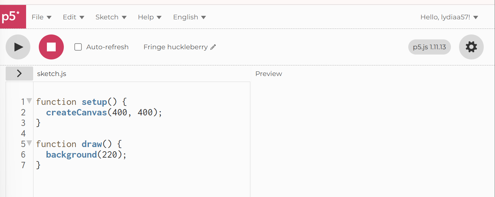

# Guide for Learners of p5:

## Why learn p5?
* **Visual Programming**: Instead of just returning text, you can draw shapes, animate and create sketches. This interactability keeps learners engaged and playing around by changing values, aids understanding as you are able to see exatly what each variable and function does. 
* **Simple Syntax**: It's built on JavaScript so is perfect for those familiar with this, but also great for beginners- who will pick up a real-world language, crucial in web development and that will lend itself well to other JS libraries.
* **Builds creativity**: Lets learners make art, games and simulations, many of which focus on creating visually appeasing products. This is an important skill to have because as valuable as problem solving (which every language teaches anyway) is, real users won't use sites that are hard to navigate, cluttered and simply ugly: p5 helps prevent that.
* **Naturally teaches core concepts**: It becomes far easier to understand concepts such as variables, conditional statements, loops, functions if you can control their actions on a screen and see results.
* **Accessible**: It is able to run in browser on [editor.p5js](https://editor.p5js.org/) which is ideal for beginners, for who it is better to start off focusing on smaller mini projects, rather than having being forced to navigate a complex IDE. The removal of this barrier also helps users focus directly on learning p5, with only a basic understanding of HTML and CSS needed to set up projects, most of which is consistent throughout templates, abstracting the learining process.

## Background Materials
In order to sufficiently cater to all kinds of learners, I shall split this section in two for each target audience: complete beginner, and proficiency with JS.

### Beginner:
The background materials that I would recommend need to serve the purpose of teaching basic concepts (loops, conditions, functions etc) needed to create something of value. If learners are younger children I recommend starting with [Scratch](https://scratch.mit.edu/) because it is a block based language that visually will teach the logical process behind coding. However, it is unlike coding in real life so for those older, I recommend [Khan Academy - Intro to JS](https://www.khanacademy.org/computing/computer-programming/programming) because it has a variety of teaching materials: talk-throughs, challenges, and projects all free and readily available online. An alternative would be [freeCodeCamp](https://www.freecodecamp.org/learn/javascript-v9/) which is more in depth and closer to real-world coding. As this is for a proper certification and completion requires higher dedication, I recommend this only for this who wish to later explore other areas of JS later. 

### Proficiency with JS:
Background materials provided here serve the purpose of aiding the transition into more complex JS. A key resource is the [MDN Web Dev Documentation](https://developer.mozilla.org/en-US/docs/Web/JavaScript) which is more of a reference than a tutorial. It shall help strengthen underlying knowledge and helps understand performance and structure, as well as [freeCodeCamp](https://www.freecodecamp.org/learn/javascript-v9/) for refreshers or go to the last sections for a challenge. 

## Learning p5
To start, I recommend going through the [p5 site](https://p5js.org/), since it is the official and hence, most reputable site. From here I started and saw numerous benefits:
* The example section website showcases the vast uses of p5: shapes and colour, games, 3D etc. This showcases the potential of what learners could make, giving them an idea of the wide variety of applications, guaranteeing they will find something for them. Additionally, each example comes with suprisingly simple code so they are able to understand how exactly it was made, and demonstrating the approachability of this language.
* The tutorials section is particularly useful. An essential one is [Setting Up Your Environment One](https://p5js.org/tutorials/setting-up-your-environment/) since it sets up working with p5. Although a variety of different ones exist, one I particularly recommend is the [Data Structure Garden](https://p5js.org/tutorials/data-structure-garden/). Firstly, it's interactive and also explores the use of: data structures like JS objects; object methods on the built-in objects; and iteration with for loops to manage multiple objects simultaneously. What I like about these tutorials is that they list the prerequisits, actually explain the code and also have what the code should look like at every step which is good for error catching. In addition, they also have ideas for what more to add (with example solutions of this too), next steps that include integrating other libraries such as node.js, mI5.js or even HTML & CSS which will great for larger projects. There are also further resources on the theory used that link to the MDN article in order to ensure that learners actually understand what they are doing, rather than mindlessly copying out code. However, if learners prefer video tutorials, rather than just article formats this may not be for them.
* The [Community](https://p5js.org/community/) section will allow learners to see what people are globally making. This is inspiration and also helps create a supportive environment since its always comforting to know that people were once in your position. And one day, maybe you learners, will upload your work here too!
For all above and any mini projects I recommend the use of the [p5 web editor](https://editor.p5js.org/) which has a simple UI as seen below:

For those who prefer a video tutorials, there are two YouTube channels that I tried and liked.
Personally, I prefer this kind of tutorial as it forces you to code along with the instructor and it feels more immersive since its a real person leading it rather than just text and images on a screen.
1. [Parr Vira](https://www.youtube.com/watch?v=eZHclqx2eJY&list=PL0beHPVMklwh3KNAibTZKkHjN4xILaWvE&index=2) has a nice set of coding tutorials. I liked the pacing and the vast variety of different things that could be made since there are 154 videos. I found it easy to follow and everything was explained well so I did not have to consult other sources outside of this one.
2. [Steve's Makerspace](https://www.youtube.com/watch?v=ZiVWNAqLDwU&list=PLnJOmsprq3bE0QLbe7wZ8yb1-Dt0FBcP5&index=1&t=2s) has a cool playlist for how code generative art which looks really interesting and I like how he explains concepts used.
Ultimately, there are many different channels for learning p5 available for free which means that learners will have the instruction for exactly what they want to make and a teacher whose style they like.

**Projects** of greater magnitude are the next step to learning a language. No one can gain proficiency by copying out code rather, they need the opportunity to plan and develop an idea, building it to fruition. Hence, I recommend the last step in the p5 journey to be a larger project after building up on these smaller ones they started with, perhaps even in the form of a hackathon. I found that the intensity and time constraint really forces one to learn quicker. p5 is useful in so many different aspects so ideas can range from a scheduler to physics simulation to games.

## Evaluation
p5 offers a high level of usefulness relative to the effort that learning it takes. Particularly because the initial learning curve is low for both those familiar with JS and beginners- because syntax is beginner friendly and there is no need to have a complex set up. One can immediately start building, which acts as great motivation and reinforces comprehension. 

p5 is a valuable because it reinforces key programming concepts, teaches how integrates mathematics to create products and introduces event-driven programming by considering mouse interactions. It is also a JS library so is a transferable skill necessary in web development and opens up the opportunity to progress further by trying: pure JS, other libraries, or for more complexity, frameworks like React.

But, if the intention behind learning p5 are industry focused, this is not be the best decision because p5 is not typically used for large scale software development project or endeavours that are performance-critical. Therefore, it may be better to pursue other tools or soon transition to them after following the p5 course.

Alternatives exist:
* **Processing**: This uses Java but is similar in design. It provides a GUI, and although slower in drawing, it is faster for calculations as it has additional classes and aliased mathematical functions and operations.
* **Python**: This is more beginner friendly, and arguably easier. It's more versatile and widely used, but often requires more set up and has a slower visual payoff. However, it has plenty of libraries such as Pygame and Turtle as well as plentiful materials online to learn.
* **Three.js**: Another JS library, but is significantly more complex and less suitable for beginners. Is the standard for 3D scenes. Logically, they are similar but Three is more object-oriented and verbose as it's designed for complex applications like game development and project visualisations. It requires proper set up, rather than just letting users draw straight on a canvas. Therefore, it seems to be the sensible next step for learners if they love p5 and would like to purse a harder challenge with greater real life applications, rather than an alternative to learning p5. 

